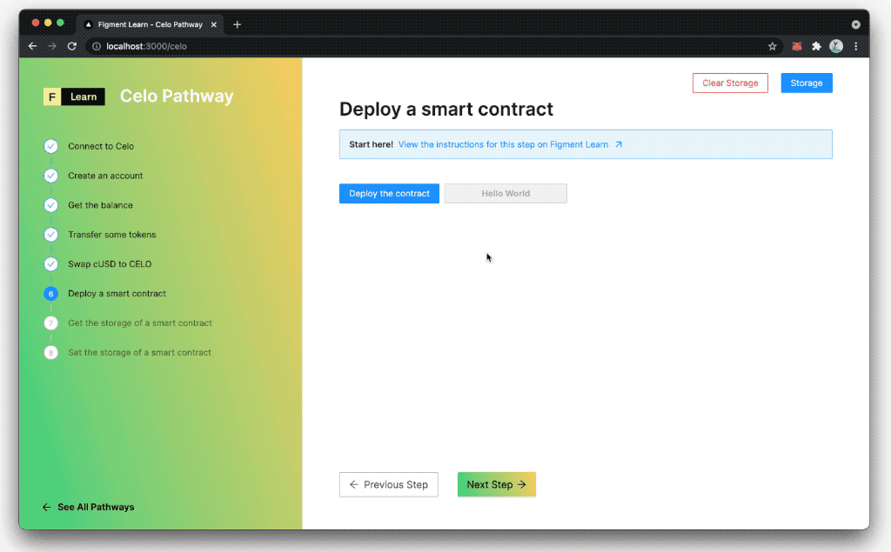

We won't go through the process of reviewing the smart contract code base, compiling it or testing it. We will focus instead on how one can deploy a smart contract using the **ContractKit** library. To do this, we're going to use a pre-compiled smart contract, you can find its Application Binary Interface under `contracts/celo/HelloWorld.json`.

Our contract will be pretty basic. It stores a string on the blockchain and implements two functions:
* The `getName` function returns the name stored on the contract.
* The `setName` function changes the name stored on the contract.


If you want to learn more about Celo smart contracts, follow the [**Deploy and Interact with Contracts (Remotely)**](https://learn.figment.io/tutorials/hello-contracts) tutorial.


----------------------------------

# Challenge


In `pages/api/celo/deploy.ts`, implement the default function. Upload your first smart contract on the **Celo** network. You must replace any instances of `undefined` with working code to accomplish this.


**Take a few minutes to figure this out.**

```tsx
//...
  try {
    const { secret, address } = req.body;
    const url = getSafeUrl();
    const kit = newKit(url);

    kit.addAccount(secret);

    // TODO: Create a transaction to deploy the contract

    const receipt = await tx.waitReceipt();

    res.status(200).json({
        address: receipt?.contractAddress as string,
        hash: receipt.transactionHash
    });
  }
//...
```

**Need some help?**
* [**Deploy a contract with ContractKit**](https://docs.celo.org/developer-guide/contractkit/usage#deploy-a-contract)  


You can [**join us on Discord**](https://figment.io/devchat), if you have questions or want help completing the tutorial.


Still not sure how to do this? No problem! The solution is below so you don't get stuck.

----------------------------------

# Solution

```tsx
// solution
//...
  try {
    const { secret, address } = req.body;
    const url = getSafeUrl();
    const kit = newKit(url);

    kit.addAccount(secret);

    let tx = await kit.sendTransaction({
        from: address,
        data: HelloWorld.bytecode
    });
    const receipt = await tx.waitReceipt();

    res.status(200).json({
        address: receipt?.contractAddress as string,
        hash: receipt.transactionHash
    });
  }
//...
```

**What happened in the code above?**

* We send a transaction using the `sendTransaction` method passing:
  * `from`, the address which will pay the fees for the transaction
  * `data`, the bytecode of our compiled contract using the `bytecode` property of the ABI stored in `contracts/celo/HelloWorld.json`. 

----------------------------------

# Make sure it works

Once you have the code above saved, click on **Deploy Contract**:



----------------------------------

# Conclusion

Now that we have deployed a smart contract, let's learn how to interact with it. In the following tutorials, we will look at how to use both view and change functions.
