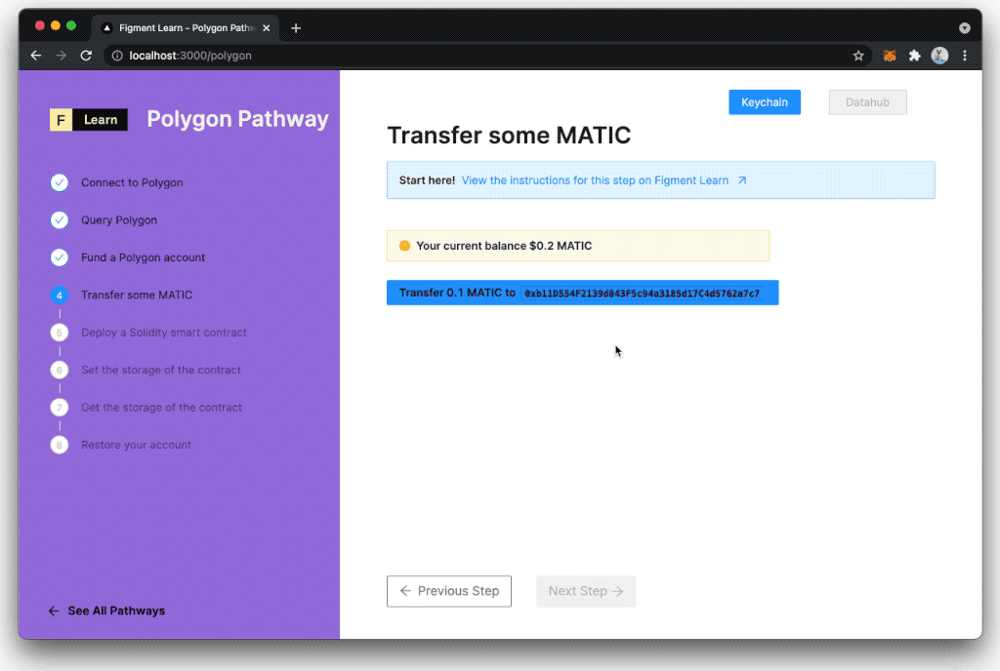

Transferring some token is one of the major feature of Web 3. In this challenge, we're going to learn how to transfer a known amount of **MATIC** to a chosen recipient. Each time a transfer occurs, we're going to re-query the new balance of our account.

-------------------------------------

# Challenge


**Imagine this scenario:** You know you have a big balance and you want to eat some pizza. Then, you need to transfer **0.1** MATIC to buy one! In `components/protocols/polygon/components/steps/Transfer.tsx`, implement the `transfer` function.


**Take a few minutes to figure this out.**

```typescript
  const transfer = async () => {
    setFetching(true);
    setError(null);
    try {
      const provider = new ethers.providers.Web3Provider(window.ethereum);
      const send_account = provider.getSigner().getAddress();

      const currentGasPrice = await provider.getGasPrice();
      const gas_price = ethers.utils.hexlify(
        parseInt(currentGasPrice.toString()),
      );

      const transaction = undefined;

      const hash =undefined;
      const receipt = await hash.wait();
      setHash(receipt.transactionHash);
    } catch (error) {
      setError(error.message);
    } finally {
      setFetching(false);
    }
  };
```

**Need some help?** Check out these two links  
* [**A short tutorial**](https://ethereum.org/en/developers/tutorials/send-token-etherjs/) on using ethers  
* [**send and sign a transaction**](https://docs.ethers.io/v5/api/signer/#Signer-sendTransaction)


You can [**join us on Discord**](https://figment.io/devchat), if you have questions or want help completing the tutorial.


Still not sure how to do this? No problem! The solution is below so you don't get stuck.

-------------------------------------

# Solution

```typescript
// solution
  const transfer = async () => {
    setFetching(true);
    setError(null);
    try {
      const provider = new ethers.providers.Web3Provider(window.ethereum);
      const send_account = provider.getSigner().getAddress();

      const currentGasPrice = await provider.getGasPrice();
      const gas_price = ethers.utils.hexlify(
        parseInt(currentGasPrice.toString()),
      );

      const transaction = {
        from: send_account,
        to: recipient,
        value: ethers.utils.parseEther('0.1'),
        nonce: provider.getTransactionCount(send_account, 'latest'),
        gasLimit: ethers.utils.hexlify(100000),
        gasPrice: gas_price,
      };
      const hash = await provider.getSigner().sendTransaction(transaction);
      const receipt = await hash.wait();
      setHash(receipt.transactionHash);
    } catch (error) {
      setError(error.message);
    } finally {
      setFetching(false);
    }
  };
```

**What happened in the code above?**

* First, we need to fill our transaction object with:
    * An address to send `from` (the sender).
    * An address to send `to` (the recipient).
    * The `value`, an amount which has been converted into a BigNumber (`ethers.utils.parseEther` is perfect for this)
    * A `nonce`, meaning "a number used once". This value is incremented by one for every transaction sent by an address.
    * A default `gasLimit`.
    * The current `gasPrice`.
* Finally we sign and send our transaction and wait for it to be confirmed.

-------------------------------------

# Make sure it works

Once the code above has been saved, enter an amount to transfer and click **Transfer**:



-------------------------------------

# Conclusion

Now that we have a funded Polygon account, we can use our MATIC tokens to deploy a smart contract. In the next tutorial we will cover writing, testing and deploying the Solidity code using Truffle which is a smart contract development suite.
