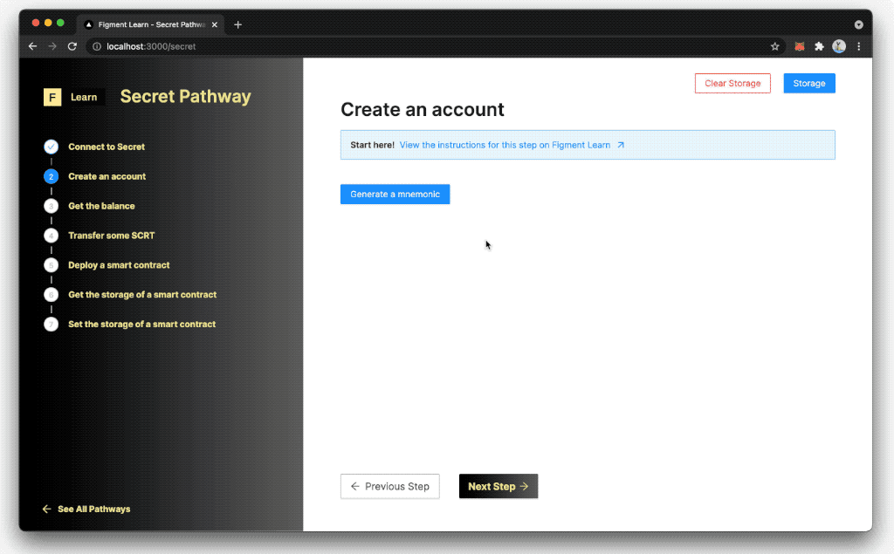

Like with most Web 3 protocols, transactions on Secret happen between **accounts**. To create an account, a client generates a **mnemonic** from which it can (re)-create a **public key** and a public address for use with a **wallet**. We're going to learn how to achieve all of this in the next challenge.

------------------------

# Challenge


In `pages/api/secret/account.ts`, implement the function to first create a **mnemonic**, then produce an **address** from the **public key** belonging to the **mnemonic**. You must replace the instances of `undefined` with working code to accomplish this.


**Take a few minutes to figure this out**

```typescript
//...
  try {
    const mnemonic = undefined;
    const signingPen = await undefined;
    const pubkey = undefined;
    const address = undefined;
    res.status(200).json({mnemonic, address})
  }
//...
```

**Need some help?** Check out these links
* [**Documentation for `@iov/crypto`'s BIP39 implementation**](https://iov-one.github.io/iov-core-docs/latest/iov-crypto/classes/bip39.html)
* [**Account example**](https://github.com/enigmampc/SecretJS-Templates/blob/master/2_creating_account/create_account.js)  


You can [**join us on Discord**](https://figment.io/devchat), if you have questions or want help completing the tutorial.


Still not sure how to do this? No problem! The solution is below so you don't get stuck.

------------------------

# Solution

```typescript
// solution
  try {
    const mnemonic = Bip39.encode(Random.getBytes(16)).toString();
    const signingPen = await Secp256k1Pen.fromMnemonic(mnemonic)
    const pubkey = encodeSecp256k1Pubkey(signingPen.pubkey);
    const address = pubkeyToAddress(pubkey, 'secret');
    res.status(200).json({mnemonic, address})
  }
```

**What happened in the code above?**

* First we create a random **mnemonic** using the `fromMnemonic` method of the `Secp256k1Pen` class.
* Next we deduce the public key from it using the `encodeSecp256k1Pubkey` function.
* Then we deduce the wallet address from it using the `pubkeyToAddress` function.
* Finally we send the mnemonic and address back to the client-side as a JSON object.


Do not forget to fund the newly created wallet using the [secret faucet](https://faucet.secrettestnet.io/) in order to activate it!


------------------------

# Make sure it works

Once the code is complete and the file is saved, Next.js will rebuild the API route. Now click on **Generate a Mnemonic** and you should see:



-----------------------------

# Conclusion
Before we make our first transfer, let's check that that the account is actually funded by asking the cluster for our balance!
