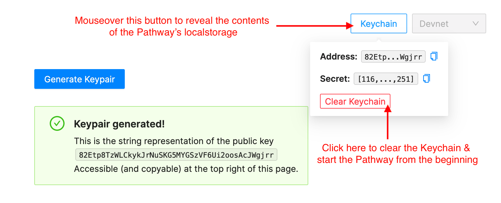

# Requirements

Make sure you've installed the [Solana CLI](https://docs.solana.com/cli/install-solana-cli-tools)'s latest release.

> **Windows Users:** There are known compatibility issues with the Solana BPF toolchain. You will need to use the Windows Subsystem for Linux. Please refer to the [installation guide](https://docs.figment.io/network-documentation/extra-guides/solana-setup-for-windows) we have provided. 
>
> **macOS Users:** If you are using any of the Apple Silicon products (M1 processor), you may need to build from source. [Refer to this GitHub PR for more information](https://github.com/solana-labs/solana/pull/16346/).

---------------------------

# Set your DataHub API key

The value for `DATAHUB_SOLANA_API_KEY` can be found on the [DataHub Services Dashboard](https://datahub.figment.io/services/solana). Click on the Solana icon in the list of available protocols and then copy your key as shown below. You can now paste your personal API key into `.env.local`. This will authenticate you and enable you to make JSON-RPC requests to the Solana cluster via DataHub.



[**Join us on Discord**](https://figment.io/devchat), if you encounter any issues with the tutorial or have any questions!


# Using a Test Validator

At some point it may be useful to run a Test Validator. For example, if can't get airdrops because the Devnet faucet is not working. To run a local Test Validator, use this command in its own terminal tab or window :

```text
solana-test-validator
``` 

Use `solana config set` to target a particular cluster. After setting a cluster target, any future subcommands will send/receive information from that cluster. To target a running Test Validator with the Solana CLI:

```text
solana config set --url https://localhost:8899
```

You can see which cluster the Solana command-line tool (CLI) is currently targeting and the paths to your keypair and configuration file with the command :

```text
solana config get
```

---------------------------

# Keypair storage

During the Pathway, you will need to generate a keypair for use in the tutorials. This information is kept in the localstorage of your web browser, and is distinct from any keypairs generated by the Solana CLI. It can be accessed or cleared via the "Keychain" button at the top right corner of the Pathway UI, as shown below:



---------------------------

# Next

If you want to know more about Solana, [check out this brief introduction](./solana-101.md).

Otherwise, you can now move ahead to the instructions of the first tutorial step by clicking on the "**Next: Connect to Solana**" button below on the right.
