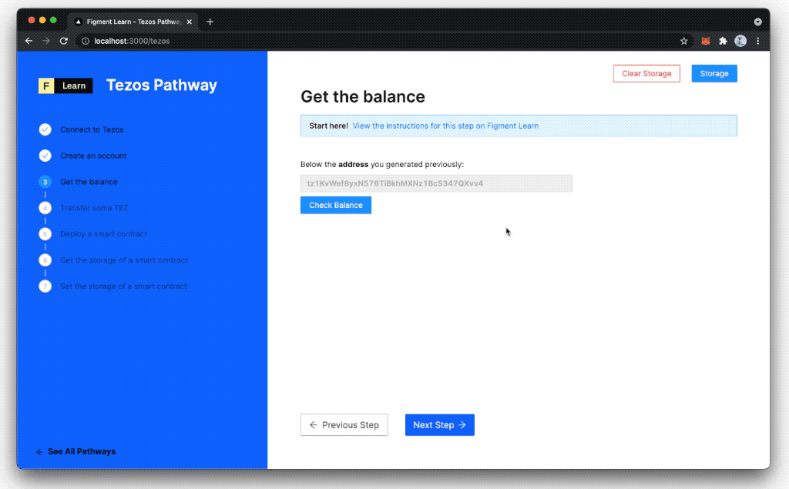

Now that we have our account created, wouldn’t it be nice to keep track of our **tez** balance? In this step, we will examine how we can do just that!


The native token on the **Tezos Blockchain** is **tez** indicated by the **ꜩ** symbol.


------------------------

# Challenge


In `pages/api/tezos/balance.ts`, implement the function and try to return the current balance of the account. You must replace the instances of `undefined` with working code to accomplish this.


**Take a few minutes to figure this out**

```typescript
//...
  try {
    const { address } = req.body;
    const url = getTezosUrl();
    const toolkit = new TezosToolkit(url);
    const balance = undefined;
    res.status(200).json(balance.toString());
  }
//...
```

**Need some help?** Check out these links
* [**method `getBalance`**](https://tezostaquito.io/typedoc/interfaces/_taquito_taquito.tzprovider.html#getbalance)
* [**Get the current Tezos balance for an address`**](https://tezostaquito.io/docs/quick_start/#get-the-current-tezos-balance-for-an-address)


You can [**join us on Discord**](https://figment.io/devchat), if you have questions or want help completing the tutorial.


Still not sure how to do this? No problem! The solution is below so you don't get stuck.

------------------------

# Solution

```typescript
// solution
//...
  try {
    const { address } = req.body;
    const url = getTezosUrl();
    const toolkit = new TezosToolkit(url);
    const balance = await toolkit.tz.getBalance(address);
    res.status(200).json(balance.toString());
  }
//...
```

**What happened in the code above?**

* First, we create a new `TezosToolkit` instance.
* Next, we call the `getBalance` method of the `tz` module, passing the address of the account we want to know the balance of.



The amount returned by `getBalance` is denominated in **μꜩ** (mutez), so to convert it to **ꜩ** you'll need to divide it by 10**6 



------------------------

# Make sure it works

Once the code is complete and the file is saved, Next.js will rebuild the API route. Click on **Check Balance** and you should see the balance displayed on the page:



-----------------------------

# Conclusion

Querying the balance information is fun, but being able to submit transactions and change the state of a blockchain is even better! In the next step, we will dive deeper and submit our first transactions on Tezos.
